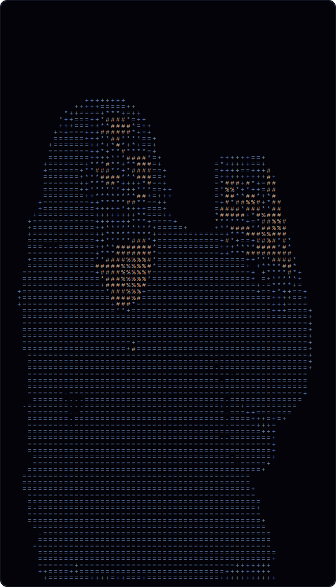

## `// T+025 — CREW FILE`

<table>
<tr>
<td width="34%" align="center">

<code>CREW ID: A-BRHM // AI · FULL-STACK · DESIGN</code>

</td>
<td width="66%" valign="top">

 

Fourth-year **AI & Data Science engineering student** at **ENSIA** (National Higher School of Artificial Intelligence, Algiers) and a working **full-stack developer** — building machine-learning pipelines, production web systems, and the security that keeps them safe.

 

**Hackathon record:** 🥇 Data Bounty (CTF) · 🥈 Hack&Train (CV) · 🏆 2nd overall / 1st AI — MOBAI

 

</td>
</tr>
</table>

## `// T+040 — INSTRUMENT ARRAY`

**`01 / WEB SYSTEMS`**

**`02 / DATA & AI CORE`**

**`03 / SECURITY & DESIGN OPS`**

## `// T+060 — FEATURED MISSIONS`

| | Mission | Telemetry | Stack |
|---|---|---|---|
| 🛰️ | **Smart Beta Platform** — stock screener & portfolio optimization | `CSA ADVISORY // FINTECH` | `C#/.NET` `FastAPI` `SCIP` |
| 🌍 | **rag.mesrs.dz** — national baccalaureate orientation guide | `MINISTRY // IN PRODUCTION` | `Laravel` `PostgreSQL` |
| 🪐 | **SIKDS** — secure institutional document distribution + RAG search | `MINISTRY // SECURITY + RAG` | `Laravel` `pgvector` `Redis` |
| 🏆 | **MOBAI forecasting model** — led the anchoring model | `★ 2ND OVERALL · 1ST AI TRACK` | `Python` `Time Series` |
| 🔭 | **Satellite image object detection** — Team MOSAIC, AI track co-lead | `★ 2ND PLACE // HACK&TRAIN` | `PyTorch` `OpenCV` |
| 🛡️ | **DNS tunneling detection** — near-real-time tunneled-traffic flagging | `LIGHTGBM // NETWORK SECURITY` | `Python` `Scapy` |

## `// T+080 — TELEMETRY`

<code>// GROUND CONTROL — ALGIERS · 36.75°N · 3.05°E</code> 
<code>EVERY TRANSMISSION GETS A REPLY ▸ </code><a href="mailto:aichabrihmouche@gmail.com"><code>OPEN A CHANNEL</code></a>

